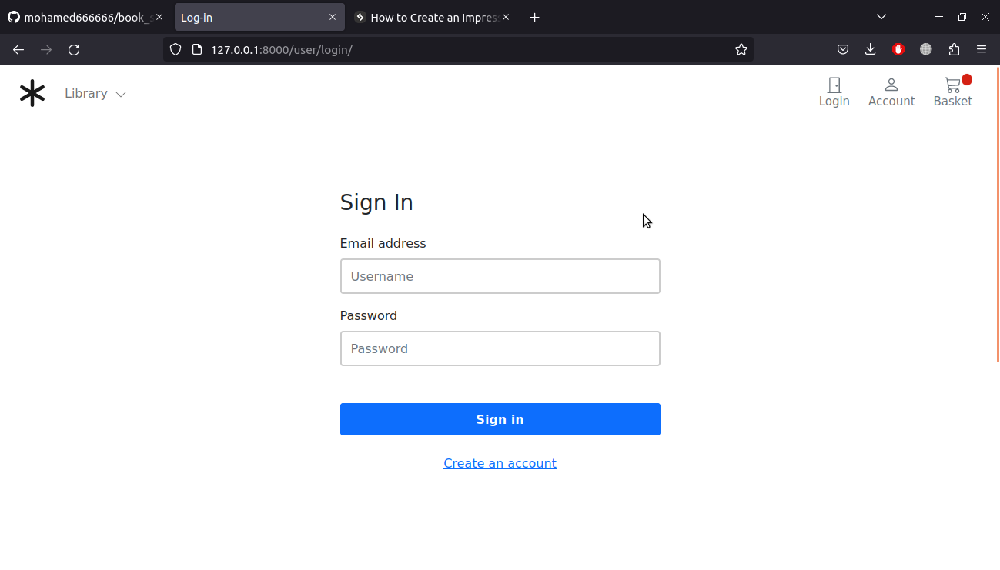
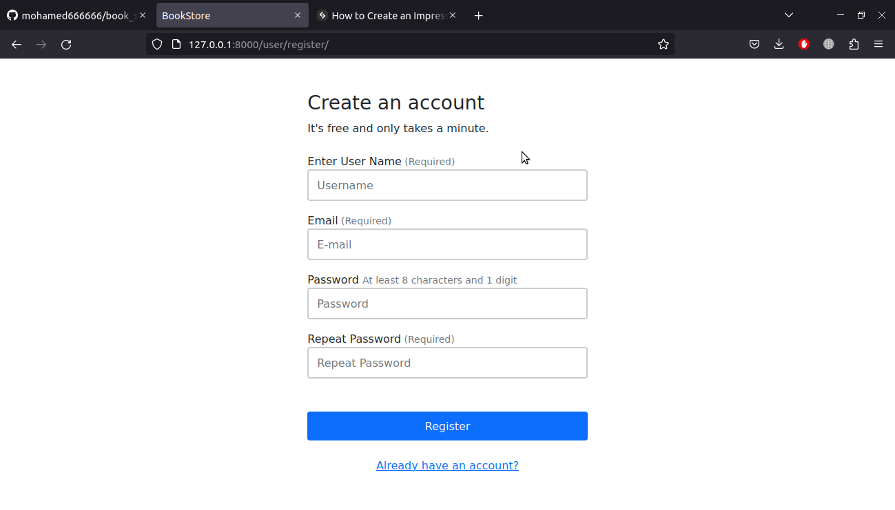
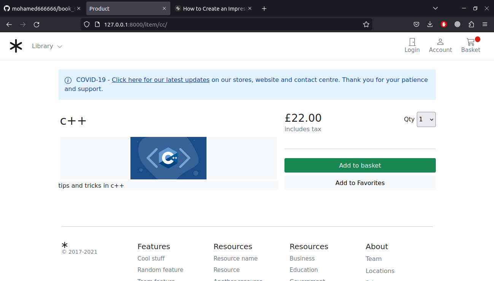
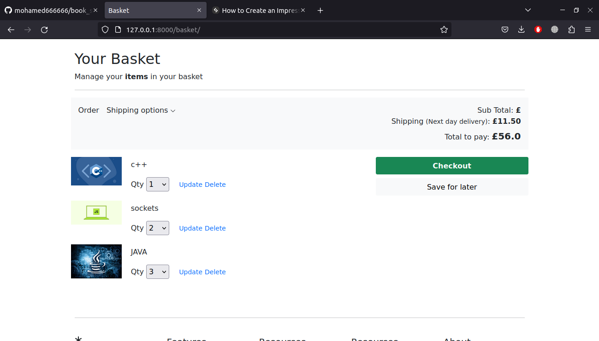

# book_store
this is eccommerce website for book store using django 

<h3>the home screen  </h3>
  

<h3>the login screen  </h3>
  

<h3>the Register screen  </h3>
  

<h3>the item screen  </h3>
  

<h3>the basket screen  </h3>
  

